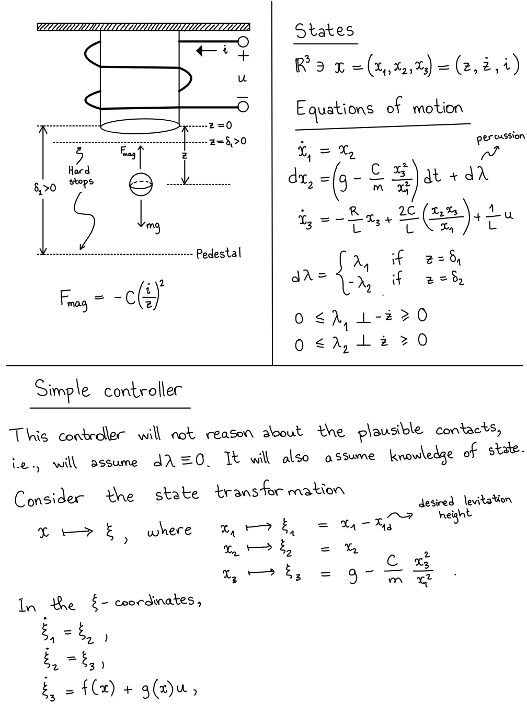
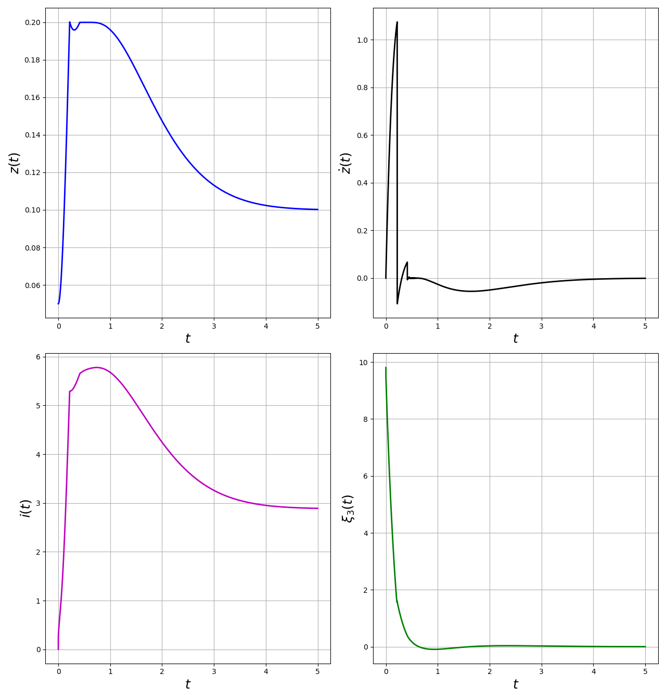

# TimeStepping

## Basic Usage

1. Define the _gap_ function with the signature
> gap(q::AbstractArray, u::AbstractArray)\
> return gap, force_matrix

2. Define the _dynamics_ function with the signature
> dynamics(q::AbstractArray, u::VecAbstractArraytor)\
> return M, h

3. If there are bilateral constraints, define the holonomic constraint functions and their derivatives (Jacobian and Jacobian_dot).
> loop(q::AbstractArray), jac(q::AbstractArray), jacdot(q::AbstractArray, u::AbstractArray)\
> return ϕ, J, Jdot

4. If there are electrical components these can be modeled using the _extradynamics_ function (see the magnetic levitation example).
> extradynamics(extra_state::AbstractArray, q::AbstractArray, u::AbstractArray)\

5. Initialize the system by providing the gap and dynamics functions, and the initial conditions (for holonomic constraints, provide them, too).
> bouncing_ball = Integrator(gap, dynamics, qA, uA; Δt=1e-3)\
> sc_ball = Integrator(gap, dynamics, loop, jac, jacdot, q0, u0; Δt=1e-3)\
> maglev = Integrator(gap, dynamics, q0, u0, extra_state0); Δt=1e-3)

6. Integrate the system until final_time
> integrate(bouncing_ball, final_time)

### Examples
Examples are provided within the _examples_ folder.

